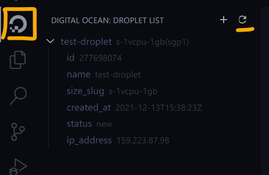

# digital-ocean-manager

Manage your Digital Ocean droplets on Visual Studio Code! You can just create a droplet (aka server or VPS) when starting work, and then destroy it before left.

[toc]

## Get Started

### Install

1. Search for `digital ocean manager` in Visual Studio Code extension market and Install it.
2. Setup your token
   1. Visit [here](https://cloud.digitalocean.com/account/api/tokens) to generate your Digital Ocean Token.
   2. Search `Digital Ocrean Manager` in your Settings (UI).
   3. Enter your token.
   4. **RELOAD** your Visual Studio Code.
   5. Enjoy! 🥰

## Usage

### View your droplet list

1. Click this icon on the sidebar, or the button on the top.

   

2. List was updated.

3. Click items to copy value, for example, you can click `ip_address` to copy "xx.xx.xx.xx" to your clipboard.

### Create a droplet

1. To start, you can:
   1. `F1` and find the command: `Digital Ocean Manager: Create Destroy`
   2. Click "add" button on the top view.
2. Select a droplet template.
3. Enter the name of new droplet.
4. A new droplet will be created.

### Destroy a droplet

1. To start, you can:
   1. `F1` and find the command: `Digital Ocean Manager: Droplet Destroy`
   2. Click "remove" button inline.
2. (Optional) Select droplet to destroy.
3. Enter to destroy it.

### Create a droplet template

It's a list of object in your Settings (JSON). Default is:

```json
{
    "do.manager.dropletTemplate": [
        {
            "name": "temp-droplet",
            "region": "sgp1",
            "image": "ubuntu-20-04-x64",
            "size_slug": "s-1vcpu-1gb",
            "backups": false
        }
    ]
}
```

### Change API

You can deploy other `do-cli` servers. 👉[do-cli repo](https://github.com/chiro2001/do-cli).

Available API now:

1. https://do.chiro.work
2. https://do-cli.deta.dev

## Attentions

I manage droplets by name, destroying droplet will destroy all droplets with the same name!
